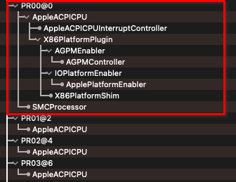
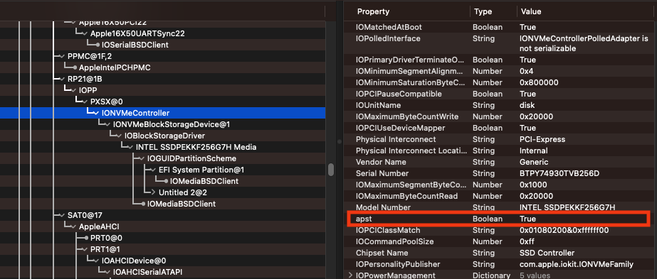

# IORegistryExplorer

## What is the I/O Registry?
The I/O Registry is a dynamic database that describes a collection of "live" objects (nubs or drivers) and tracks the provider-client relationships between them. When hardware is added or removed from the system, the Registry is immediately updated to reflect the new configuration of devices. A dynamic part of the I/O Kit, the Registry is not stored on disk or archived between boots. Instead, it is built at each system boot and resides in memory.

The I/O Registry is made accessible from user space by APIs in the I/O Kit framework. These APIs include powerful search mechanisms that allow you to search the Registry for an object with particular characteristics. You can also view the current state of the Registry on your computer using applications provided with the developer version of OS X.

## I/O Registry Architecture and Construction
It is most useful to think of the I/O Registry as a tree: Each object is a node that descends from a parent node and has zero or more child nodes.

At boot time, the I/O Kit registers a nub for the Platform Expert, a driver object for a particular motherboard that knows the type of platform the system is running on. This nub serves as the root of the I/O Registry tree. The Platform Expert nub then loads the correct driver for that platform, which becomes the child node of the root. The Platform driver discovers the buses that are on the system and it registers a nub for each one. The tree continues to grow as the I/O Kit matches each nub to its appropriate bus driver, and as each bus driver discovers the devices connected to it and matches drivers to them.

Keeping the tree-like structure of the I/O Registry in mind, now visualize each node extending into the third dimension like a column. The two-dimensional Registry tree, with the Platform Expert nub at its root, is now visible on a plane that cuts perpendicularly through these columns. The I/O Kit defines a number of such planes (you can think of them as a set of parallel planes cutting through the columns at different levels). 


There are six planes defined in the I/O Registry:
* Service
* Audio
* Power
* Device Tree
* FireWire
* USB

NOTE: all I/O Registry objects exist on all planes, but on any individual plane, only those objects connected by the relationship defined by that plane are visible.

## How to read I/O Registry?
I recommend to read ioreg to use [the program offered by utopia-team](https://github.com/utopia-team/IORegistryExplorer/releases/latest).

## What is it for us?
We use IOReg to see the compatibility of our computer with MacOS.

For MacOS to work it needs some devices that normal computers often don't have (for example EC).
We also add patches to make our system more compatible.

## What can we see?
### CPU Power Management
To see if the Power Management (SSDT-PLUG) works you have to go to the first core of your processor (the name can be found in the DSDT) and check if something like this is found under ```AppleACPICPU```:



NOTE: if you search for AppleACPICPU in ioreg it will not show you any results under AppleACPICPU as you have to remove the search.

More information:
* [Dortania ACPI](https://dortania.github.io/Getting-Started-With-ACPI/Universal/plug.html)
* [Dortania Post-Install](https://dortania.github.io/OpenCore-Post-Install/universal/pm.html)
* [OC Little Translated](https://github.com/5T33Z0/OC-Little-Translated/tree/main/01_Adding_missing_Devices_and_enabling_Features/CPU_Power_Management)

### NVMeFix
If you have an NVMe you can check the correct functioning of NVMeFix through the ```apst``` parameter.

NOTE: ```apst``` is inside ```IONVMeController```.



More information:
* [NVMeFix README](https://github.com/acidanthera/NVMeFix)

## Credits
* **Apple** for macOS and IORegistryExplorer
